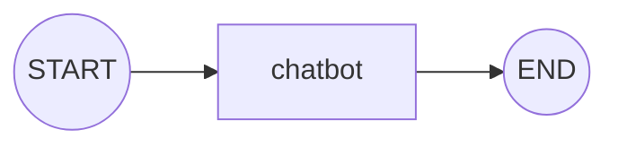

# Simple LangGraph Chatbot — Code Walkthrough & Memory Concept

A minimal, iterative chatbot built with LangGraph: one node, one state key (`messages`), and a `while` loop driving the conversation. This README explains the code line-by-line, then explains exactly how (and why) it "remembers" a conversation.

---

## 1. The Code

```python
from typing import Annotated, TypedDict
from langgraph.graph import StateGraph, START, END
from langgraph.graph.message import add_messages
from langgraph.checkpoint.memory import MemorySaver
from langchain_anthropic import ChatAnthropic
from langchain_core.messages import BaseMessage, HumanMessage, AIMessage

# 1. State — a list of BaseMessage, with a built-in reducer that appends
class State(TypedDict):
    messages: Annotated[list[BaseMessage], add_messages]

# 2. LLM
llm = ChatAnthropic(model="claude-sonnet-4-5")

# 3. Node — takes current state, calls the LLM, returns a partial update
def chatbot(state: State) -> dict:
    response: AIMessage = llm.invoke(state["messages"])
    return {"messages": [response]}   # only the new AIMessage is returned

# 4. Build the graph
graph = StateGraph(State)
graph.add_node("chatbot", chatbot)
graph.add_edge(START, "chatbot")
graph.add_edge("chatbot", END)

# 5. Compile with a checkpointer so state persists across turns
memory = MemorySaver()
app = graph.compile(checkpointer=memory)

# 6. The iterative loop — this is what makes it a real conversation
config = {"configurable": {"thread_id": "chat-1"}}

print("Chatbot ready. Type 'quit' to exit.")
while True:
    user_input = input("You: ")
    if user_input.lower() in ("quit", "exit"):
        break

    result = app.invoke(
        {"messages": [HumanMessage(content=user_input)]},
        config=config
    )
    print("Bot:", result["messages"][-1].content)
```

### Graph visualization



The graph itself is deliberately tiny — one node, no branches, no loop inside the graph. All the "conversation" behavior comes from combining this graph with a **reducer** and a **checkpointer**, explained below.

---

## 2. Code Explained, Section by Section

### 2.1 State Definition

```python
class State(TypedDict):
    messages: Annotated[list[BaseMessage], add_messages]
```

- The state schema has exactly **one key**: `messages`, typed as `list[BaseMessage]`.
- `Annotated[list[BaseMessage], add_messages]` attaches a **reducer** to this key. `add_messages` is LangGraph's built-in reducer specifically designed for chat histories.
- Without this reducer, every update to `messages` would **replace** the old list with whatever new list a node returns — you'd lose the entire conversation history every turn. With `add_messages`, new messages are **appended** to the existing list instead of overwriting it (and it also handles de-duplication by message ID, so re-sending the same message doesn't double it).
- **Why `BaseMessage` specifically** — see Section 2.2, right below, since this choice is directly tied to how the node and the LLM talk to each other.

### 2.2 Why `BaseMessage` in the State (not `str`)

Whenever we talk to an LLM through LangChain, we don't exchange raw strings — we exchange **message objects**, because a conversation isn't just a pile of text, it's a pile of text each carrying a **role**: who said it, and in what capacity.

`BaseMessage` is the common parent class for every message type LangChain/LangGraph works with:

- **`HumanMessage`** — something the user said.
- **`AIMessage`** — something the model said.
- **`SystemMessage`** — an instruction/persona set for the model.
- **`ToolMessage`** — a result returned from a tool call.

All of these **inherit from `BaseMessage`**, so typing the state as `list[BaseMessage]` means the list can correctly hold *any mixture* of these — human turns, AI turns, system prompts, tool outputs — in one ordered sequence, which is exactly what a real conversation history looks like.

This matters for three concrete reasons:

1. **The LLM needs role information, not just text.** `llm.invoke(state["messages"])` works because `ChatAnthropic` (and any LangChain chat model) expects a list of `BaseMessage` objects — it reads each message's role to know "this part was the user, this part was me," and builds the correct prompt format internally. If the state only stored plain strings, that role information would be lost, and the model couldn't tell who said what.
2. **The reducer (`add_messages`) operates on `BaseMessage` objects.** It relies on each message having an `id` (for de-duplication) and a `type`/role, both of which come from the `BaseMessage` structure — a bare string has neither.
3. **Type correctness and extensibility.** Typing the field as `list[BaseMessage]` (rather than `list` or `list[str]`) makes the schema self-documenting and lets you later add `SystemMessage` (to set behavior) or `ToolMessage` (if you add tool-calling) to the *same* list without changing the state schema at all — they're all still `BaseMessage` subclasses.

So, concretely in this code:
- User input is wrapped as `HumanMessage(content=user_input)` before being sent in.
- The model's reply comes back from `llm.invoke()` already as an `AIMessage` (that's `ChatAnthropic`'s return type) — we don't construct it ourselves, we just return it.
- Both are `BaseMessage` subclasses, so both fit into the same `list[BaseMessage]` state field, and the reducer appends each one onto the growing conversation history correctly, with its role intact.

### 2.3 The LLM

```python
llm = ChatAnthropic(model="claude-sonnet-4-5")
```

This is just the model the single node will call. Swappable for any chat model LangChain supports.

### 2.4 The Node

```python
def chatbot(state: State) -> dict:
    response: AIMessage = llm.invoke(state["messages"])
    return {"messages": [response]}
```

- A node is just a Python function. Its input is the **current state** — here, `state["messages"]` is the full conversation so far (every `HumanMessage` + `AIMessage` accumulated up to this point).
- It calls the LLM with that entire history, so the model has full context, not just the latest message.
- `llm.invoke()` returns an `AIMessage` — this is what gets returned as the **partial update**: `{"messages": [response]}`, just the *new* message, not the whole list. LangGraph passes this through the `add_messages` reducer, which appends it onto the existing `messages` in the state rather than overwriting the list.

### 2.5 Building the Graph

```python
graph = StateGraph(State)
graph.add_node("chatbot", chatbot)
graph.add_edge(START, "chatbot")
graph.add_edge("chatbot", END)
```

- `StateGraph(State)` creates the graph, using `State` as its schema.
- One node, `"chatbot"`, registered with its function.
- Two edges: `START → chatbot` (entry point) and `chatbot → END` (exit). No conditional edges, no loop — this graph runs exactly one node per `invoke()` call.

### 2.6 Compiling With a Checkpointer

```python
memory = MemorySaver()
app = graph.compile(checkpointer=memory)
```

- `.compile()` validates the graph structure and prepares it to run — same as any LangGraph graph.
- Passing a **checkpointer** (`MemorySaver`, an in-RAM checkpoint store) is what turns this from a stateless one-shot graph into something that can remember previous turns. After every `invoke()`, the resulting state gets saved as a checkpoint; on the next `invoke()`, LangGraph loads that checkpoint instead of starting from scratch.

### 2.7 The Iterative Loop

```python
config = {"configurable": {"thread_id": "chat-1"}}

while True:
    user_input = input("You: ")
    if user_input.lower() in ("quit", "exit"):
        break
    result = app.invoke({"messages": [HumanMessage(content=user_input)]}, config=config)
    print("Bot:", result["messages"][-1].content)
```

- `thread_id` is the key that ties separate `invoke()` calls together as "the same conversation." Every call that uses `"chat-1"` reads/writes the same saved state.
- The **iteration lives in this Python `while` loop**, not inside the graph. Each loop pass:
  1. Takes user input and wraps it in a `HumanMessage`.
  2. Calls `app.invoke()` with just that *new* message (not the whole history — LangGraph fetches the saved history for you via `thread_id`).
  3. Prints the last message in the returned state — the `AIMessage`'s `.content`, i.e. the model's newest reply.
- The graph runs `START → chatbot → END` fresh on every single call — it's the checkpointer + reducer combination that makes it *feel* like one continuous conversation across many calls.

---

## 3. The Memory Concept — How This Chatbot "Remembers"

### 3.1 What happens on a single turn
1. You call `app.invoke({"messages": [HumanMessage(...)]}, config)`.
2. LangGraph loads the saved checkpoint for `thread_id="chat-1"` (the conversation so far) as the starting state.
3. Your new `HumanMessage` is merged into `messages` via the `add_messages` reducer — appended to the end of the existing list.
4. The `chatbot` node runs, sees the *entire* updated history (a list of `BaseMessage` objects — `HumanMessage`s and `AIMessage`s interleaved), and generates a reply.
5. That reply (an `AIMessage`) is returned as a partial update (`{"messages": [response]}`), and the reducer appends it too.
6. At the end of the invoke, the **full resulting state** (the whole `messages` list, now longer by 2) is written back out as a new checkpoint, still under `thread_id="chat-1"`.

### 3.2 What happens across turns
- Turn 2's `invoke()` doesn't start empty — it loads the checkpoint saved at the end of turn 1, appends the new `HumanMessage` + `AIMessage`, and checkpoints again.
- This is exactly why the model "remembers" earlier parts of the conversation: every turn, it's handed the *entire accumulated history*, with each message's role preserved, not just your latest message as a bare string.

### 3.3 Why this memory is temporary, not permanent
- `MemorySaver` stores checkpoints **in RAM** — inside the running Python process's memory, nothing is written to disk or a database.
- As long as the program keeps running and you keep using the same `thread_id`, the conversation history accumulates and persists across turns — this is real memory, just **scoped to the program's lifetime**.
- The moment the program exits, that RAM is released by the OS. All checkpoints for every `thread_id` are gone. Running the script again and reusing `"chat-1"` starts from an empty `messages` list, as if the chatbot had never spoken to you before.

**In short:** this chatbot has **session-level (temporary) memory** — full recall of the conversation while the program is running — but **no persistent memory** across separate runs of the program.

### 3.4 Making the memory permanent (optional upgrade)
If you want memory that survives a restart, swap the checkpointer for a disk- or database-backed one — nothing else in the code changes:

```python
from langgraph.checkpoint.sqlite import SqliteSaver

with SqliteSaver.from_conn_string("chatbot_memory.db") as memory:
    app = graph.compile(checkpointer=memory)
    # ... same while loop as before ...
```

Now checkpoints are written to a SQLite file on disk instead of RAM, so the same `thread_id` can resume the exact same conversation even after you close and reopen the program. (`PostgresSaver` works the same way for a production database instead of a local file.)

---

## Summary

| Piece | Role |
|---|---|
| `State` with `Annotated[list[BaseMessage], add_messages]` | Defines the shared memory as a role-aware message list, with a reducer so messages **append** instead of overwrite |
| `BaseMessage` (`HumanMessage` / `AIMessage`) | The common message type LangChain LLMs require, so each entry carries *who said it*, not just raw text |
| `chatbot` node | Reads full history, calls the LLM, returns only the new `AIMessage` (partial update) |
| Graph (`START → chatbot → END`) | A single-node graph, re-run once per turn — no loop inside the graph itself |
| `MemorySaver` checkpointer | Saves/restores state in RAM, keyed by `thread_id` |
| `thread_id` | Identifies "which conversation" — reusing it continues the same history |
| Outer `while` loop | The actual iteration — drives repeated `invoke()` calls, one per user turn |
| **Result** | Memory that persists across turns **within one run**, but is lost when the program exits — unless the checkpointer is swapped for a disk/DB-backed one (`SqliteSaver`, `PostgresSaver`) |