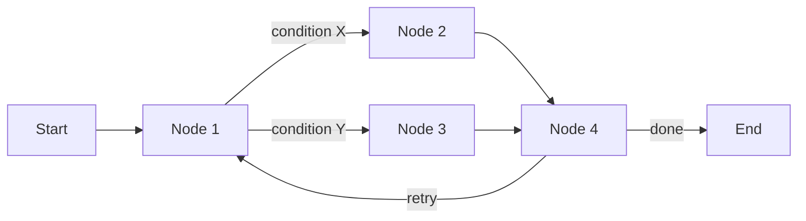
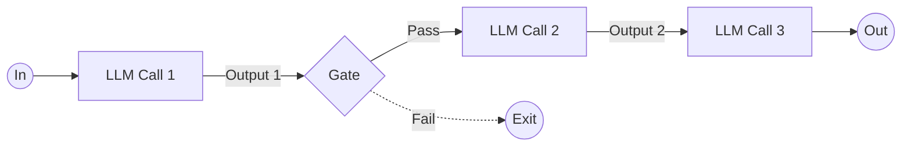
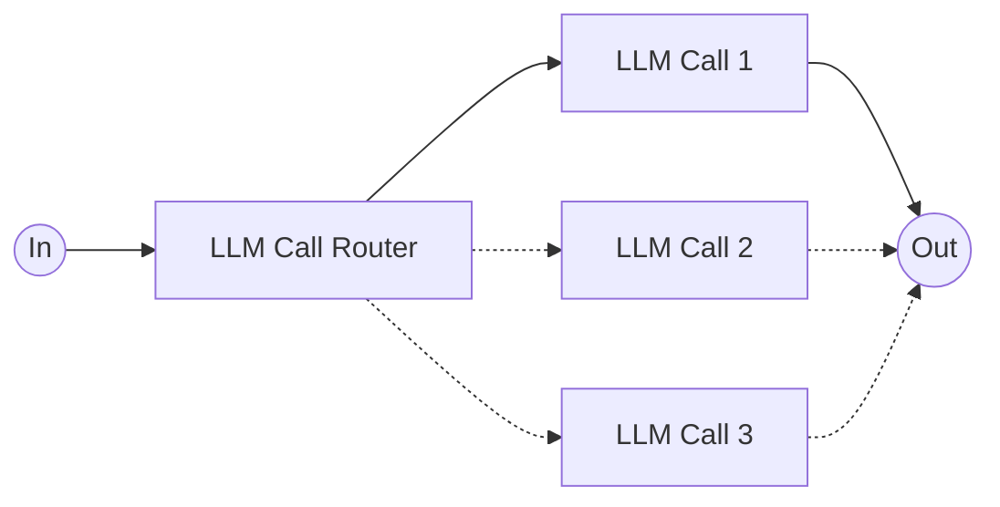
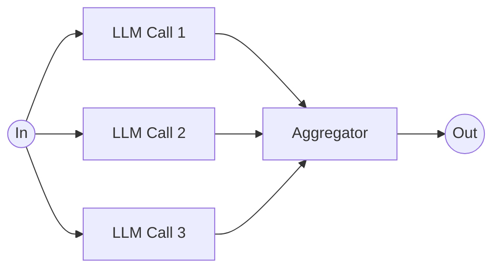
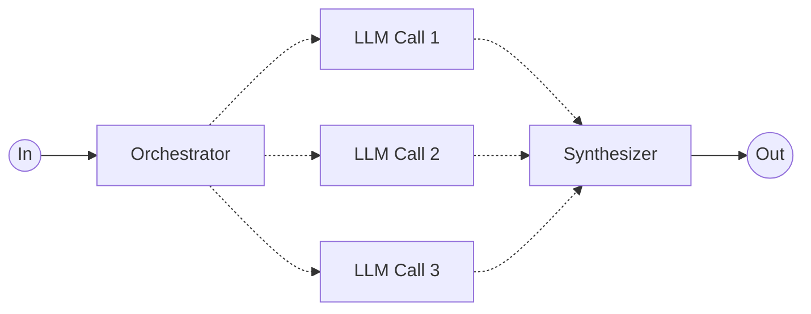
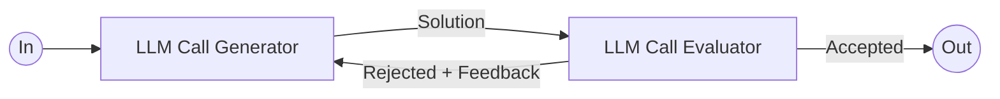
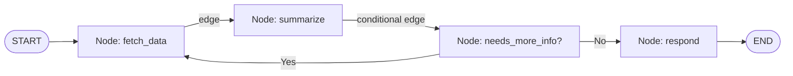
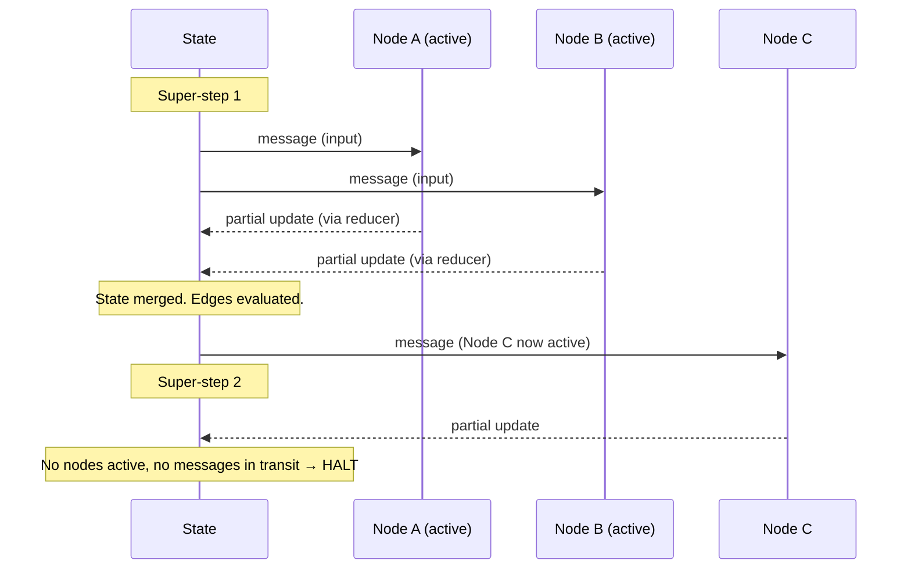

# LangGraph Core Concepts — A Detailed Guide

---

## 1. What is LangGraph?

> **LangGraph is an orchestration framework for building intelligent, stateful, and multi-step LLM workflows.**

Let's unpack that definition piece by piece:

- **Orchestration framework** — LangGraph doesn't call an LLM for you like a simple wrapper does. It *coordinates* many pieces of work (LLM calls, tool calls, human input, retries) and decides the order and conditions under which they run.
- **Intelligent** — the flow of execution can be decided dynamically (by an LLM or by logic), not just hardcoded.
- **Stateful** — the workflow remembers what happened before. Every step can read and write to a shared memory object called **state**.
- **Multi-step** — real applications are rarely "one prompt in, one answer out." They involve several stages: retrieve → reason → call a tool → verify → respond.

Three more defining ideas:

- LangGraph enables **parallelism** (do several things at once), **loops** (repeat a step until a condition is met), **branching** (take different paths depending on the situation), **memory** (carry state across steps and even across sessions), and **resumability** (pause and continue execution later — e.g., after a human approves something).
- This combination makes it ideal for **agentic** and **production-grade AI applications** — systems that need to behave reliably, not just demo well once.
- Most importantly: **LangGraph models your logic as a graph of nodes (tasks) and edges (routing), instead of a linear chain.**

This last point is the biggest mental shift coming from simpler frameworks. A linear chain looks like:

```
Step 1 → Step 2 → Step 3 → Done
```

A graph looks like:



Notice the graph can branch, merge, and even loop back on itself. That's the power LangGraph gives you that a simple chain cannot.

---

## 2. LLM Workflows

Before diving into LangGraph's specific building blocks, it helps to understand the general concept of an **LLM workflow**, since LangGraph exists to implement these.

1. **LLM workflows are a step-by-step process** using which we can build complex LLM applications. Instead of asking one giant prompt to do everything, we break the problem into manageable stages.
2. **Each step in a workflow performs a distinct task** — such as prompting, reasoning, tool calling, memory access, or decision-making. Each step has one clear job.
3. **Workflows can be linear, parallel, branched, or looped**, allowing for complex behaviors like retries, multi-agent communication, or tool-augmented reasoning.
4. **Common workflows** — there is a well-known set of design patterns that most agentic systems are built from. These are:
   - Prompt Chaining
   - Routing
   - Parallelization
   - Orchestrator–Workers
   - Evaluator–Optimizer

Let's go through each one, what it looks like as a diagram, and a concrete example of when you'd use it.

---

## 3. Prompt Chaining

**Diagram:**



**What it is:**
Prompt chaining breaks a task into a **sequence of LLM calls**, where the output of one call becomes the input of the next. Between steps, you can optionally insert a **gate** — a programmatic check that validates the intermediate output before letting it continue. If the check fails, the workflow can exit early instead of wasting further LLM calls on bad input.

**Why use it:**
It trades a single, complex prompt (which is hard for the model to get exactly right in one shot) for several simpler, more reliable prompts, each focused on one sub-task. This usually increases accuracy at the cost of extra latency and token usage.

**Example:**
Imagine generating a **marketing blog post**:
1. **LLM Call 1** — generate a detailed outline from a topic.
2. **Gate** — a Python function checks the outline has at least 5 sections and no banned words.
3. **LLM Call 2** — expand the outline into a full first draft.
4. **LLM Call 3** — polish tone, fix grammar, and add a call-to-action.
5. **Out** — the final blog post.

If the gate fails (outline too short, or contains something disallowed), the workflow exits instead of generating a full draft from a bad outline.

---

## 4. Routing

**Diagram:**



**What it is:**
Routing uses an initial LLM call (or classifier) to **inspect the input and decide which specialized path** it should be sent down. Instead of one generic LLM call trying to handle every possible input type well, you have several specialized calls, each optimized for a particular category of input — and the router picks the right one.

**Why use it:**
Different inputs often need very different handling. A single "does everything" prompt is a compromise; separate, focused prompts per category (each with its own instructions, examples, or even model) perform better than one generalist prompt.

**Example:**
A **customer support triage system**:
- **LLM Call Router** — classifies the incoming ticket by *topic* (e.g., billing, technical issue, general question).
- If topic = billing → **LLM Call 1**, a prompt specialized in refund/payment policy.
- If topic = technical → **LLM Call 2**, a prompt with access to troubleshooting docs.
- If topic = general → **LLM Call 3**, a simple FAQ-answering prompt.

Each branch is tuned for its category, so answers are far more accurate than one prompt trying to handle billing, tech support, and FAQs all at once.

---

## 5. Parallelization

**Diagram:**



**What it is:**
Parallelization splits a single **task into independent subtasks** that are run **simultaneously** (rather than one after another), and then combines ("aggregates") their results into a final output. The key idea, annotated on the diagram, is **task → subtask**: the original problem is decomposed into pieces that don't depend on each other, so they can run at the same time.

**Why use it:**
- **Speed** — subtasks run concurrently instead of sequentially, cutting latency.
- **Quality via consensus** — the same task can be run multiple times (e.g., 3 independent attempts) and the aggregator can vote/merge the best answer.

**Example:**
**Content moderation** on a piece of user-submitted text:
- **LLM Call 1** — checks for hate speech.
- **LLM Call 2** — checks for spam/scam patterns.
- **LLM Call 3** — checks for personally identifiable information (PII).
- **Aggregator** — combines all three verdicts into one moderation decision (e.g., "flagged for PII, otherwise clean").

Because the three checks are independent of each other, they can run in parallel rather than waiting on one another, and the aggregator produces one unified report.

---

## 6. Orchestrator–Workers

**Diagram:**



**What it is:**
This pattern looks similar to Parallelization, but with an important difference: instead of the subtasks being *fixed in advance*, a central **Orchestrator** LLM **dynamically decides** what subtasks are needed at runtime, based on the specific input (**task → subtasks**, decided on the fly). It then dispatches work to "worker" LLM calls, and a **Synthesizer** merges their results into a final answer.

**Why use it:**
Use this when you don't know ahead of time how many subtasks are needed or what they should be — the orchestrator figures that out dynamically for each new input, making the workflow flexible instead of rigid.

**Example:**
A **"research this topic" agent**:
- **Orchestrator** — reads the user's research question and decides it needs 3 sub-questions to answer it well (this number and content change per query).
- **LLM Call 1, 2, 3** — each worker researches/answers one of the dynamically generated sub-questions (possibly using tools/search).
- **Synthesizer** — combines all sub-answers into one coherent research report.

If the user asked a simpler question, the orchestrator might only spawn 1 worker; if it's a complex question, it might spawn 5. That decision is made dynamically, unlike the fixed 3-way split in plain Parallelization.

---

## 7. Evaluator–Optimizer

**Diagram:**



**What it is:**
One LLM (the **Generator**) produces a candidate solution. A second LLM (the **Evaluator**) critiques it against some criteria. If the evaluator **rejects** it, it sends feedback back to the generator, which tries again with that feedback in mind — a **loop**. If the evaluator **accepts** it, the solution is returned as the final output.

**Why use it:**
This mimics the human "draft → critique → revise" cycle. It's especially useful when quality matters more than speed, and when there's a clear way to judge whether an output is "good enough" (e.g., code that must pass tests, a translation that must preserve meaning).

**Example:**
**Code generation with self-correction**:
- **Generator** — writes a Python function to solve the given problem.
- **Evaluator** — runs the function against unit tests (or has an LLM review it for correctness/style).
- If tests fail → **Rejected + Feedback** ("Function fails on empty list input") is sent back to the Generator, which rewrites the code.
- If tests pass → **Accepted**, and the final code is returned.

This loop can run for a fixed number of iterations, or until the evaluator accepts the answer.

---

## 8. Graph, Nodes, and Edges

This is the structural backbone of LangGraph — everything above (chaining, routing, parallelization, etc.) is *implemented* using this vocabulary:

- **Graph** — the entire workflow, represented as a `StateGraph` object. It's the "map" of your application.
- **Nodes** — the individual **tasks**. In LangGraph, a node is simply a **custom Python function** (or a callable/LLM call/tool) that takes the current state as input and returns an update to that state. Each node does one distinct job — call an LLM, query a database, call a tool, run some business logic, etc.
- **Edges** — the **routing** between nodes. An edge defines which node's output flows into which node's input — i.e., it represents the **flow of transfer** of control (and data) through the graph.
  - **Normal edges** — always go from Node A to Node B.
  - **Conditional edges** — a function inspects the current state and decides, *dynamically*, which node to go to next (this is how Routing and the "Gate" / "Pass/Fail" branches from earlier diagrams are implemented).

Put together:



This is exactly why LangGraph calls itself graph-based rather than chain-based: nodes are the vertices (tasks), edges are the connections (routing logic), and by combining conditional edges with loops you can express any of the workflow patterns from Section 3–7.

---

## 9. State in LangGraph

> **In LangGraph, state is the shared memory that flows through your workflow — it holds all the data being passed between nodes as your graph runs.**

Let's go deeper into how state actually works:

### 9.1 Defining State
You define a **state schema** up front, describing what fields exist and what type they are. This is commonly done with:
- **`TypedDict`** — a lightweight, dictionary-like schema (from Python's `typing` module).
- **Pydantic `BaseModel`** — a schema with built-in validation, defaults, and type-checking.

Example using `TypedDict`:

```python
from typing import TypedDict, List

class AgentState(TypedDict):
    question: str
    documents: List[str]
    answer: str
```

Example using Pydantic:

```python
from pydantic import BaseModel

class AgentState(BaseModel):
    question: str
    documents: list[str] = []
    answer: str = ""
```

Pydantic additionally gives you runtime validation (e.g., type errors are caught immediately), which is valuable in production systems.

### 9.2 State is Shared
Every node in the graph reads from and writes to the **same** state object conceptually. This is what makes it "shared memory" — a node three steps downstream can still see data a node produced at the very beginning, without you having to manually thread it through every function call in between.

### 9.3 State is Mutable (via Updates, Not Direct Mutation)
Although we say state is "mutable" across the workflow's lifetime — it changes as execution proceeds — LangGraph does **not** let nodes silently mutate the global object in-place. Instead:

1. **Each node's input is the current state** (or the relevant slice of it).
2. **The node performs a partial update** — meaning it returns only the fields it changed (e.g., just `{"answer": "..."}`), not the entire state object.
3. **LangGraph merges that partial update into the state**, producing a new version of the state.
4. **The new state is passed onward** to the next node(s) via **message passing** along the edges.

```python
def generate_answer(state: AgentState) -> dict:
    # Reads from state
    docs = state["documents"]
    question = state["question"]

    # ... call an LLM here ...
    answer = call_llm(question, docs)

    # Returns only a PARTIAL update
    return {"answer": answer}
```

This partial-update model is important: nodes stay simple and decoupled — they don't need to know or preserve the *entire* state, just the piece they're responsible for. LangGraph handles merging that piece back into the whole via the graph's underlying message-passing mechanism (more on this in Section 11).

---

## 10. Reducers

> **Reducers in LangGraph define how updates from nodes are applied to the shared state.**

### 10.1 The Problem Reducers Solve
By default, when a node returns a partial update for a key, LangGraph's default behavior is to simply **replace** the old value with the new one. That's fine for most fields (e.g., overwrite `answer` with the newest answer). But it **fails** for other kinds of fields:

- If multiple nodes (e.g., in a parallel step) each want to **add a message** to a running conversation history, a plain "replace" policy would cause each node's update to overwrite the others — you'd lose all but the last message instead of accumulating all of them.
- If you want to **merge** two dictionaries (e.g., combine partial metadata from different nodes) rather than one clobbering the other, "replace" is the wrong semantics too.

This is exactly why "replace" alone isn't sufficient — different fields need different **update policies**.

### 10.2 The Solution: Per-Key Reducers
**Each key in the state can have its own reducer**, which determines whether new data:
- **Replaces** the existing value (default behavior),
- **Merges** into the existing value (e.g., combining dictionaries), or
- **Adds/Appends** to the existing value (e.g., appending a new message to a list of messages).

In code, this is typically expressed using `Annotated` types with a reducer function, most famously `operator.add` for list-appending message state:

```python
from typing import Annotated, TypedDict
from operator import add

class AgentState(TypedDict):
    question: str
    # This key uses a reducer: new messages are APPENDED, not replaced
    messages: Annotated[list, add]
    answer: str
```

With this, if **Node A** returns `{"messages": ["Hi"]}` and, in the same super-step, **Node B** returns `{"messages": ["Hello"]}`, the reducer ensures the final state has `messages: ["Hi", "Hello"]` — both are kept — rather than one silently overwriting the other.

**In short:** reducers exist because a single "replace" policy cannot correctly express every kind of state update your workflow needs; different keys need different merge strategies (replace / add / merge), and LangGraph lets you configure that per key.

---

## 11. LangGraph Execution Model

LangGraph's execution model has four conceptual phases:

### 11.1 Graph Definition
You define:
- **The state schema** — the shape of the shared memory (Section 9).
- **Nodes** — functions that perform tasks (Section 8).
- **Edges** — which node connects to which, including conditional edges (Section 8).

```python
from langgraph.graph import StateGraph, START, END

graph = StateGraph(AgentState)
graph.add_node("fetch_docs", fetch_docs)
graph.add_node("generate_answer", generate_answer)
graph.add_edge(START, "fetch_docs")
graph.add_edge("fetch_docs", "generate_answer")
graph.add_edge("generate_answer", END)
```

At this stage, nothing runs yet — you're just describing the structure of the workflow, like drawing a blueprint.

### 11.2 Compilation
You call **`.compile()`** on the `StateGraph`.

```python
app = graph.compile()
```

This step **checks the graph structure** — validating that nodes referenced in edges actually exist, that there are no dangling/unreachable nodes, that the entry and exit points are well-formed — and **prepares it for execution** (e.g., building the internal execution engine, wiring up the message-passing channels for each state key, attaching reducers). Compilation catches structural mistakes *before* you ever run the graph, similar to how a compiler catches syntax errors before a program runs.

### 11.3 Invocation
You run the compiled graph with **`.invoke(initial_state)`**.

```python
result = app.invoke({"question": "What is LangGraph?", "documents": [], "answer": ""})
```

**LangGraph sends the initial state as a message to the entry node(s)** — i.e., execution begins by delivering your starting state as the first "message" to whatever node(s) are connected to `START`. This kicks off the actual run.

### 11.4 Super-Steps Begin
This is where LangGraph's execution model becomes genuinely interesting (and is explored in full detail in the next section): **execution proceeds in rounds**, where each round is called a **super-step**.

---

## 12. Super-Steps, Message Passing, and the Halting Condition

This is the heart of how LangGraph actually executes a graph at runtime — understanding it explains *why* LangGraph can support parallel branches, loops, and complex fan-out/fan-in patterns cleanly.

### 12.1 What is a Super-Step?
A **super-step** is one full "round" of execution. LangGraph doesn't run your graph node-by-node in a simple sequential loop; instead, it processes execution in discrete rounds, and **within a single round, multiple nodes can run at once**.

Think about *why* this is necessary: when a node passes the shared state forward via message passing, it sometimes needs to send it to **multiple downstream nodes simultaneously** (think of the Parallelization or Orchestrator–Workers patterns from Sections 5–6, where one input fans out to `LLM Call 1`, `LLM Call 2`, and `LLM Call 3` at the same time). Each of those nodes will independently perform its own **partial update** to the state. LangGraph needed a clean, well-defined unit of execution to describe "all the things that happen concurrently as a result of the previous round" — and that unit is the **super-step**.

### 12.2 What Happens Inside One Super-Step
Within each round (super-step):
- **All active nodes** — meaning all nodes that **received a message** at the end of the previous round — **run in parallel**. If three nodes were all triggered simultaneously (e.g., by a fan-out edge), all three execute within the *same* super-step, concurrently, not one after another.
- **Each active node returns an update (a message) to the state.** This is the node's partial state update, as described in Section 9.3 — it gets combined with whatever other updates arrive in this same super-step, using the reducers configured for each key (Section 10). This is precisely why reducers matter so much: if `LLM Call 1` and `LLM Call 2` both run in the *same* super-step and both update the `messages` key, the reducer decides whether the second update overwrites the first (replace) or whether both are kept (add/merge).

### 12.3 Message Passing & Node Activation
Once a super-step finishes producing its combined state update:
- **The messages (state updates) are passed to downstream nodes via edges.** LangGraph looks at the graph structure and follows the edges leading out of whichever nodes just ran, to determine where the resulting state should go next.
- **Nodes that receive messages become "active"** for the *next* round. Being "active" simply means: this node has new input waiting for it, so it will be executed in the next super-step.

This message-passing mechanism is what lets LangGraph implement everything from Sections 3–7: a **conditional edge** decides *which* downstream node(s) get a message (this is how Routing/Gates work); an edge pointing back to an earlier node is what makes a **loop** possible (this is how Evaluator–Optimizer's rejection loop works); and an edge fanning out to several nodes at once is what makes **parallel branches** possible (Parallelization, Orchestrator–Workers).

### 12.4 The Halting Condition
So when does the graph stop running? **Execution stops when:**
- **No nodes are active**, **and**
- **No messages are in transit.**

In other words, the graph halts once a super-step completes and produces *no* new messages destined for *any* node — there's nothing left activated, and nothing still "on the wire" waiting to be delivered. At that point, LangGraph considers the run complete and returns the final accumulated state as the result of `.invoke()`.

This is a clean, elegant halting rule: rather than the framework needing some special "I'm done" signal, the graph naturally terminates the moment the wave of activity it kicked off has nowhere left to propagate — much like a chain reaction that stops once no atom is left to trigger the next one.

### 12.5 Putting It All Together — A Mental Model



Every node run you see in a LangGraph trace belongs to some super-step. Nodes in the *same* super-step ran concurrently as a response to the *previous* round's output; the graph keeps advancing, round by round, until a round produces silence — no active nodes, no messages in flight — and that silence is the signal that the workflow is complete.

---

## Summary Table

| Concept | One-line definition |
|---|---|
| **Graph** | The full workflow blueprint (`StateGraph`) |
| **Node** | A Python function performing one task |
| **Edge** | Routing/flow of data & control between nodes (can be conditional) |
| **State** | Shared, versioned memory passed between nodes |
| **Reducer** | Per-key policy for how updates are merged: replace / add / merge |
| **Compilation** | Validates graph structure, prepares execution engine |
| **Invocation** | `.invoke()` sends the initial state as a message to entry node(s) |
| **Super-step** | One round of execution where all active nodes run in parallel |
| **Message passing** | How state updates travel along edges to activate downstream nodes |
| **Halting condition** | Execution stops when no nodes are active and no messages are in transit |