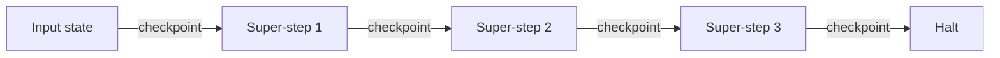
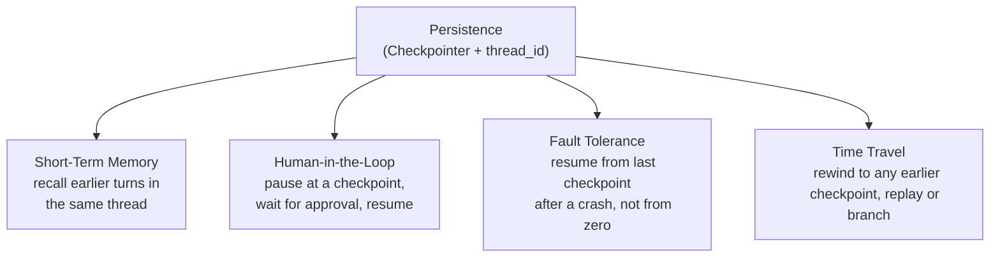

# Persistence in LangGraph — A Detailed Guide

---

## 1. What is Persistence in LangGraph?

**Persistence** is LangGraph's mechanism for **saving the state of a graph as it executes**, so that state isn't lost the moment a run finishes — it can be reloaded, resumed, inspected, or rewound later.

In plain terms: persistence is what turns a graph from something that runs once and forgets everything, into something that **remembers** — across turns, across crashes, and across time.

---

## 2. The Problem Persistence Solves

By default, a LangGraph graph has **no memory of its own**. Here's the core behavior you need to understand first:

- Every time you call `app.invoke(initial_state)`, LangGraph builds the graph's execution fresh, starting from exactly the `initial_state` you passed in.
- Once the workflow reaches its halting condition (no active nodes, no messages in transit — see the Execution Model), the run is **over**. The in-memory state that existed during that run is not automatically kept anywhere.
- If you call `.invoke()` **again**, LangGraph doesn't know anything about the previous run. It starts over from scratch with whatever new `initial_state` you give it — the old conversation, the old intermediate values, all of it is gone, as if the first run never happened.

This is a real problem for anything beyond a single, one-shot execution:
- A chatbot would forget the user after every single message.
- A long-running agent would lose all progress if the process crashed halfway through.
- There would be no way to pause a workflow for a human to review, then continue it later.

**Persistence exists specifically to solve this.** By attaching a **checkpointer** to the compiled graph, LangGraph automatically saves the state as the graph runs, so a later `.invoke()` can **load that saved state instead of starting from zero** — continuing the same workflow rather than restarting it.

---

## 3. The Speciality of Persistence: It Saves *Everything*, Not Just the Final Answer

A naive memory system might only save the final output of a run. LangGraph's persistence is more thorough than that:

> **Persistence stores *all* intermediate state values, not just the final one — a snapshot is saved after every super-step, not only at the very end.**

This means if a graph has, say, 5 steps, persistence doesn't just remember "here's what came out at the end" — it remembers the state **after step 1, after step 2, after step 3**, and so on, each as its own saved checkpoint.

### Why this matters: Fault Tolerance
Because every intermediate state is saved (not just the final result), if the process **crashes or is interrupted midway** through a long workflow, nothing is truly lost:
- You don't have to re-run the whole workflow from the beginning.
- You can resume from the **last successfully completed step**, since its state was already checkpointed.
- This is the foundation of **fault tolerance** — a core benefit covered in detail in Section 6.

---

## 4. Checkpoints — How Persistence is Actually Implemented

The concept of persistence in LangGraph is implemented through a component called a **checkpointer**.

### 4.1 Dividing the Graph into Checkpoints
LangGraph conceptually divides a graph's execution into a sequence of **checkpoints** — save points along the run. At each checkpoint, the **current state is saved** to a storage backend:
- **In RAM** — using `MemorySaver`, which keeps checkpoints in the process's memory. Fast, but gone once the program exits.
- **In a database/disk** — using something like `SqliteSaver` or `PostgresSaver`, which writes checkpoints to persistent storage. Survives restarts and crashes.

```python
from langgraph.checkpoint.memory import MemorySaver

memory = MemorySaver()
app = graph.compile(checkpointer=memory)
```

Swapping to a persistent backend only changes which object you pass as `checkpointer` — the graph and node code don't change at all.

### 4.2 How a Checkpoint is Decided at Each Super-Step
The question of **when** a checkpoint is taken has a precise answer: **a checkpoint is saved at every super-step boundary**.

- At the very start of `.invoke()`, before any node runs, the **input state** itself is saved as the first checkpoint.
- Then, each **super-step** (one round of execution where all currently-active nodes run in parallel and their partial updates get merged into state via reducers) completes, and the **resulting merged state** is saved as a new checkpoint.
- This repeats for every super-step until the halting condition is reached (no active nodes, no messages in transit).



Checkpointing happens **after** the whole super-step finishes (not mid-way through it), because a super-step can have multiple nodes running in parallel — checkpointing only once all of them have finished and their updates are merged guarantees every saved snapshot is a complete, consistent state, never a half-updated one.

Each checkpoint stores:
- The full state at that point.
- A `checkpoint_id` (unique identifier).
- A pointer to its **parent checkpoint**, forming a chain — this chain is what later enables time travel (Section 7).
- Metadata like which node(s) just ran and which node(s) are "next."

---

## 5. Thread ID — Why It's Necessary

A checkpointer alone isn't enough — LangGraph also needs a way to know **which conversation or run** a given checkpoint belongs to. That's what `thread_id` is for.

```python
config = {"configurable": {"thread_id": "chat-1"}}
app.invoke({"messages": [...]}, config=config)
```

### Why we need it
- A single compiled graph + a single checkpointer is typically used to serve **many separate conversations/users/sessions** at once (e.g., a chatbot backend talking to hundreds of different users).
- Without some kind of identifier, every `.invoke()` call would have no way to distinguish "continue user A's conversation" from "continue user B's conversation" — all the saved state would blur together into one shared, meaningless pile.
- `thread_id` **partitions** the checkpointer's storage: every checkpoint is saved and looked up under a specific `thread_id`, so reusing the same `thread_id` continues that exact conversation, and using a different one starts (or continues) a completely separate, isolated one.

### Why it's necessary, concretely
- **Isolation** — user A's messages never leak into user B's state, even though both run through the same graph and checkpointer.
- **Resumability per conversation** — you can come back to `thread_id="chat-1"` hours or days later (with a persistent backend) and it resumes exactly where that specific thread left off.
- **Concurrency** — many threads can be active at once without colliding, since each is keyed separately.
- **Scoped history/time-travel** — `get_state_history(config)` and rewinding are scoped to one `thread_id`, so you inspect or replay *that* conversation, not everything the checkpointer has ever stored.

In short: **`thread_id` is what makes persistence usable for more than one conversation at a time** — without it, a single checkpointer could only ever meaningfully track one continuous run.

---

## 6. The Four Benefits of Persistence



---

### 6.1 Short-Term Memory

**What it is:** the ability for a graph to recall earlier parts of the *same* conversation/thread as it continues.

**How persistence implements it:**
1. Every node's input is the full `state`, which includes a `messages` field (or similar) built up over time.
2. When a node returns an update, it's a **partial update** — just the new piece (e.g., the newest AI message) — and a **reducer** (like `add_messages`) merges it onto the existing list rather than overwriting it.
3. At the end of each `.invoke()` call, the **full merged state** (the entire accumulated history) is checkpointed under the thread's `thread_id`.
4. On the **next** `.invoke()` call with the same `thread_id`, LangGraph loads that checkpoint as the starting state *before* running any node — so the new turn's node sees the whole prior conversation, not just the newest message.

This is exactly how a chatbot "remembers" what you said three messages ago: the checkpointer keeps reloading and re-appending to the same growing `messages` list every turn.

---

### 6.2 Fault Tolerance

**What it is:** the ability to survive a crash or interruption without losing all progress.

**How persistence implements it:**
- Because a checkpoint is saved after **every** super-step (not just at the end of the whole run), the "last known good state" is never far away.
- If the process crashes mid-workflow — say, after step 3 of a 6-step graph — the checkpoint from step 3 is already safely saved (assuming a persistent backend like `SqliteSaver`/`PostgresSaver`, not just in-RAM `MemorySaver`).
- On restart, you resume execution **from that last checkpoint** (passing its config into `.invoke()`), rather than re-running steps 1–3 again or losing the run entirely.
- This matters most in long-running, expensive, or multi-step agentic workflows (tool calls, multi-agent orchestration), where repeating already-completed work would be wasteful or in some cases not even safely repeatable (e.g., a tool call that sends an email shouldn't fire twice).

---

### 6.3 Human-in-the-Loop

**What it is:** the ability to **pause** a running graph at a specific point, let a human inspect or approve the state, and then **resume** execution — without the graph needing to restart or lose context.

**How persistence implements it:**
- LangGraph lets you configure `interrupt_before` or `interrupt_after` a given node when compiling the graph.
- Because a checkpoint already exists at every super-step boundary, pausing is simple: execution just **stops right at that checkpoint** instead of continuing to the next super-step. The current state is already safely saved — nothing special needs to happen to "freeze" it.
- A human (or external system) can then inspect `app.get_state(config)`, optionally edit the state (`app.update_state(config, new_values)`), and when ready, call `.invoke(None, config=config)` to **resume** execution from exactly that checkpoint, continuing forward as if it had never paused.

This pattern is essential for things like approving a risky tool call, reviewing an AI-drafted message before it's sent, or letting a person correct the agent's course mid-task.

---

### 6.4 Time Travel

**What it is:** the ability to go back to an **earlier checkpoint** in a thread's history and either replay it or branch off with different input — instead of being stuck only with the latest state.

**How persistence implements it:**
- Since checkpoints are chained via `parent_config` (each one points back to the one before it), the full history of a thread isn't discarded as new checkpoints are added — it's preserved as a traversable chain.
- `app.get_state_history(config)` returns every checkpoint ever saved for that `thread_id`, in order, each with its own `checkpoint_id`.
- You can take **any** of those earlier checkpoints and pass it as the `config` into a new `.invoke()` call:
  - With `None` as input, it simply **resumes/replays** forward from that earlier point.
  - With new input, it **branches** — creating an alternate continuation from that point, while the original continuation still exists untouched in the checkpoint history.

```python
history = list(app.get_state_history({"configurable": {"thread_id": "chat-1"}}))
older_checkpoint = history[2].config

# Replay forward from that point
app.invoke(None, config=older_checkpoint)

# Or branch with different input
app.invoke({"messages": [HumanMessage(content="different question")]}, config=older_checkpoint)
```

**Benefits of time travel:**
- **Debugging** — rewind to right before a node produced a bad output and inspect exactly what state it saw.
- **"What if" exploration** — try a different input or tool result from the same starting point without re-running everything from the beginning.
- **Non-destructive experimentation** — branching never erases the original path; both timelines coexist in the checkpoint history, similar to branching in Git.

---

## Summary Table

| Concept | One-line definition |
|---|---|
| **Persistence** | Saving graph state so it survives beyond a single `.invoke()` call |
| **Problem it solves** | Without it, every `.invoke()` starts from scratch, discarding all prior state |
| **Speciality** | Saves *every* intermediate checkpoint, not just the final state |
| **Checkpointer** | The component that saves state to RAM or a database at each checkpoint |
| **Checkpoint timing** | One checkpoint per super-step boundary, including the initial input |
| **`thread_id`** | Partitions saved state so many independent conversations can be tracked separately |
| **Short-term memory** | Reloading the accumulated `messages` state each turn via checkpoint + reducer |
| **Fault tolerance** | Resuming from the last saved checkpoint instead of restarting after a crash |
| **Human-in-the-loop** | Pausing at a checkpoint (`interrupt_before`/`after`) for review, then resuming |
| **Time travel** | Rewinding to any past checkpoint to replay or branch, via the parent-linked checkpoint chain |sse:\10_persistence.ipynb